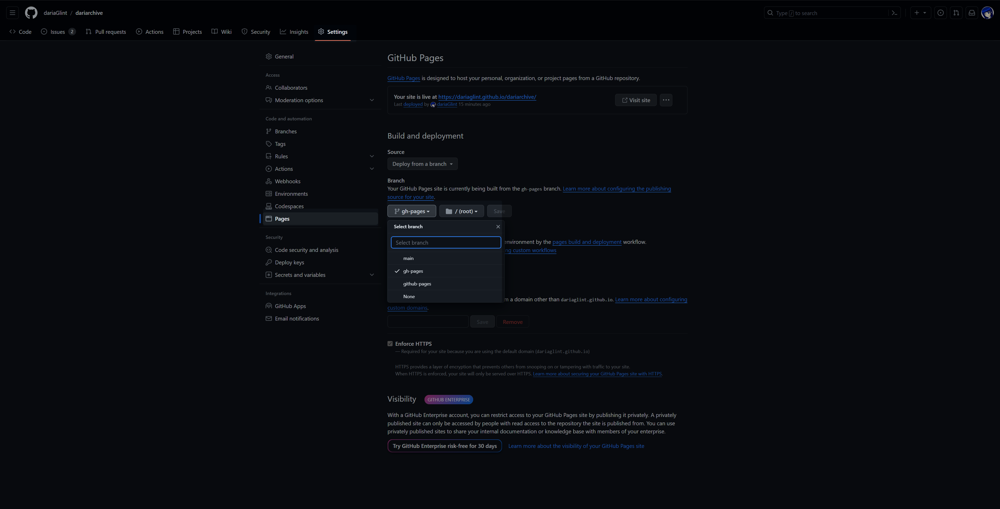

# MkDocs 環境構築

## 環境構築

mkdocsをインストールするためにbashに下記を入力
```Bash
pip install mkdocs              #mkdocsをインストール
mkdocs --version                #mkdocsがインストールできたか確認
```

mkdocsをインストールしたら下記コマンドでプロジェクトを作成してそこにmarkdownファイルを追加していく
```Bash
mkdocs new test-pages/          #mkdocsのプロジェクトをカレントディレクトリで作成する
```

既にGitリポジトリを作成してる方は上記コマンドで生成された`docs`ディレクトリと中に入ってる`index.md`,`mkdocs.yml`ファイルを 公開したいディレクトリに置く

```Bash
Gitリポジトリ/
　├ docs/        #追加
　│　└ index.md   #追加
　├ mkdocs.yml   #追加
　└ 
```
今後記事を追加する場合はdocsディレクトリの中にmarkdownファイルを追加していく流れになる。

公開したWebサイトでPlantUMLなどを使う場合は使えるように下記をインストールしておくと良い
```bash
pip install plantuml-markdown   #web上でplantumlを使えるようにする
pip install pymdown-extensions  #web上でmermaidを使えるようにする
```
## サイト構築

準備が出来たら以下のコマンドを打つと`site`ディレクトリができて、その中に生成されたhtmlファイルが格納される
```Bash
mkdocs build
```

生成したサイトをローカル環境でプレビューしたい場合は以下のコマンドを打つと以下のURLをブラウザで開くとプレビューできるようになる。
```Bash
mkdocs serve
```

http://127.0.0.1:8000/

プレビューを終えたい場合はBashを開いた状態で`Ctrl+C`を押すとプレビューが解除される

## Github Pagesに公開

リポジトリGithub Pagesに公開する場合は、以下のbashを打つ
```Bash
mkdocs gh-deploy
```

そうすると`Github`の`Setting`→`Pages`にブランチが追加されているので`gh-pages`ブランチが作成されているので、それに切り替えると確認できるようになる


## ハマったこと

mkdocs.ymlでエラーが出た時はインデントの設定が上手くできてないみたいなので、スペースとインデントはきちんと見た方がいい。
一応`mkdocs build`で`WARNING`が出るので出たときは見直した方がいい。

```yaml
theme:
  name: readthedocs
  icon:
 # logo: material-library //スペースは駄目
    logo: material-library #インデントなのでこれは正しい
   
  palette:
    # Palette toggle for light mode
    - scheme: default
      toggle:
        icon: material/brightness-7
        name: Switch to dark mode
    # Palette toggle for dark mode
    - scheme: slate
      toggle:
        icon: material/brightness-4
        name: Switch to light mode
```

[configuration issue (idk wat title to put) #3222](https://github.com/squidfunk/mkdocs-material/issues/3222)

## 参考
[MkDocsによるドキュメント作成](https://zenn.dev/mebiusbox/articles/81d977a72cee01)

