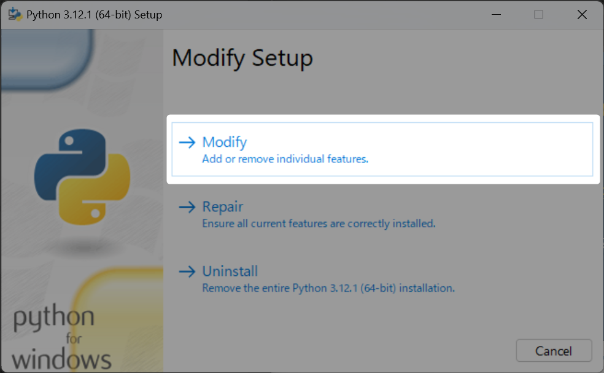
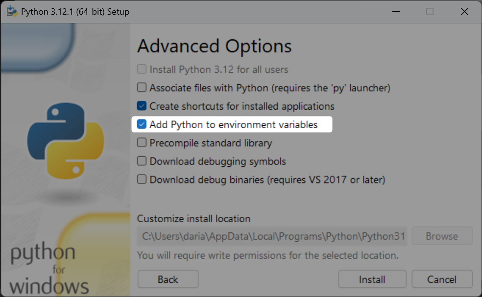

# Pythonのインストール
## ダウンロード
[ここから](https://www.python.org/downloads/)`Download Python　その時の最新バージョン`のボタンを落してダウンロードする


## pipが実行できない
`pip`コマンドを打っても以下の様に実行できないことがある。

```Bash
'pip' は、内部コマンドまたは外部コマンド、
操作可能なプログラムまたはバッチ ファイルとして認識されていません。
```


その時は環境パスの設定がうまく行ってないかも知れない。

既にインストールしてしまったが環境パスを設定する方法は以下になります。
1. pythonのインストーラー(僕の場合はpython-3.12.1-amd64.exe)を再度実行する
2. `Modify`を選択
3. `Add Python to environment variables`にチェックを入れて右下の`Install`を選択

上の対応を入れたらコマンドプロンプトを開いて、以下のコマンドを入れてバージョン情報が返ってきたら成功
```bash
pip --version
pip 23.2.1 from　pipが入ってるパス
```

## 参考
[windowsでpipコマンドを使う方法｜インストール〜環境変数の設定まで](https://rikei-danshi.work/entry/windows-pip)