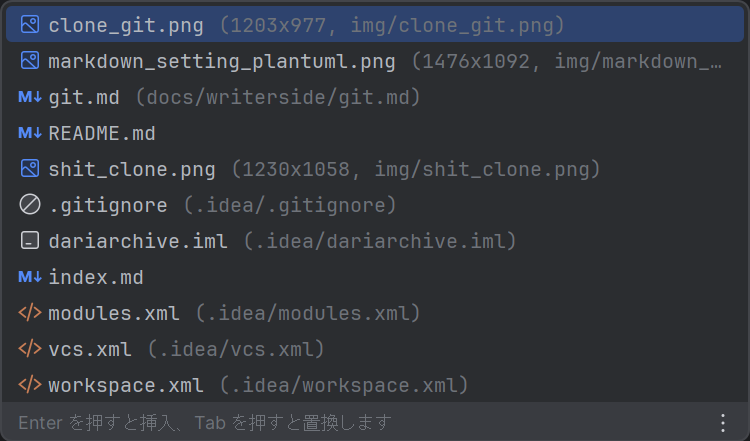
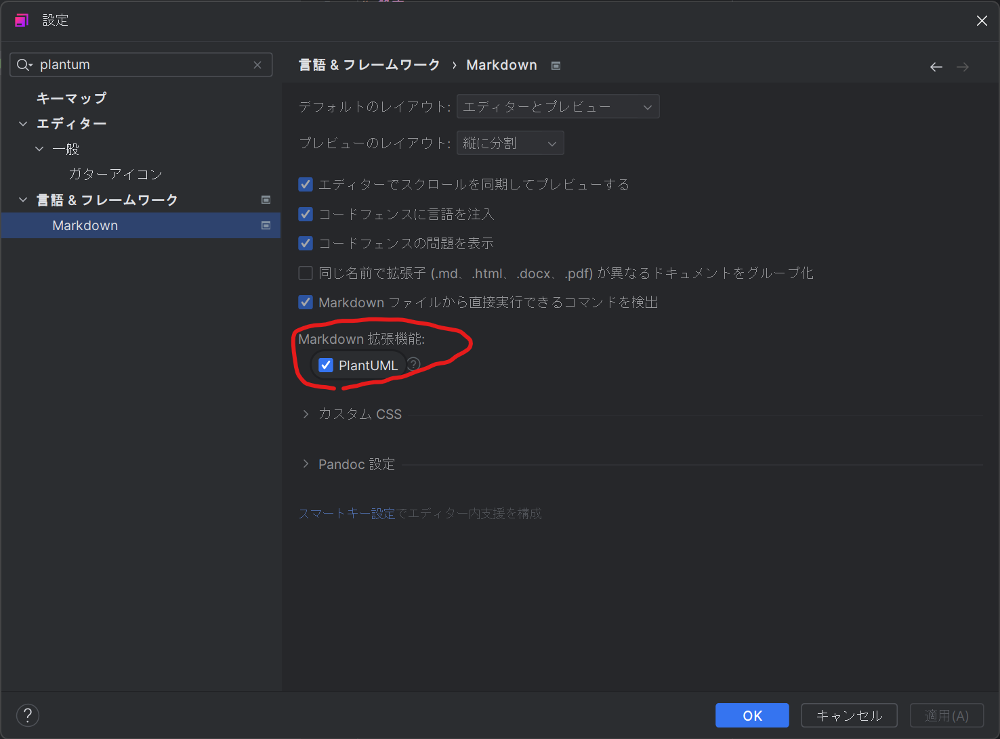
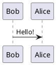
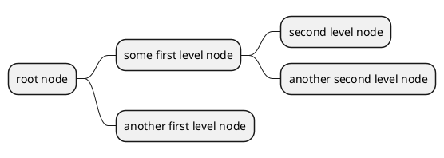

# markdown
## 画像の追加
相対パスの画像の追加は![]の後の()の中にカーソルを持ってきて、Ctrl+Spaceを2回押すと全体の候補が出てくる

## PlantUML
Markdownで設定するには「設定」→「言語&フレームワーク」→「Markdown」
→「PlantUML」にチェックを入れるだけ

基本的な使い方は以下

知らなかったけどマインドマップもかけるらしい
